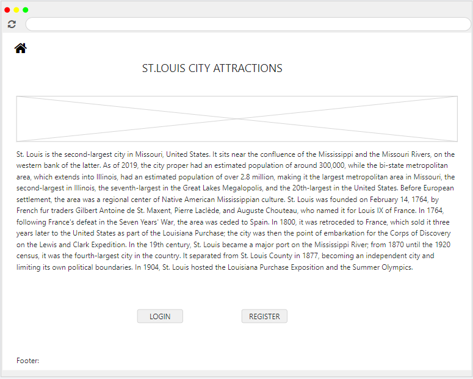
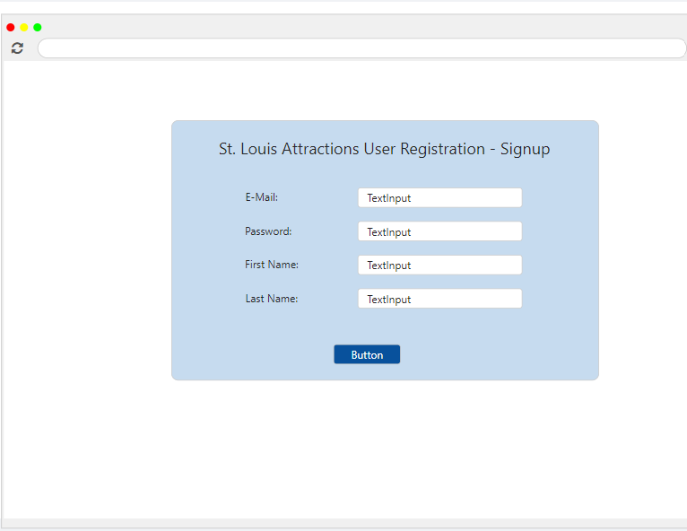
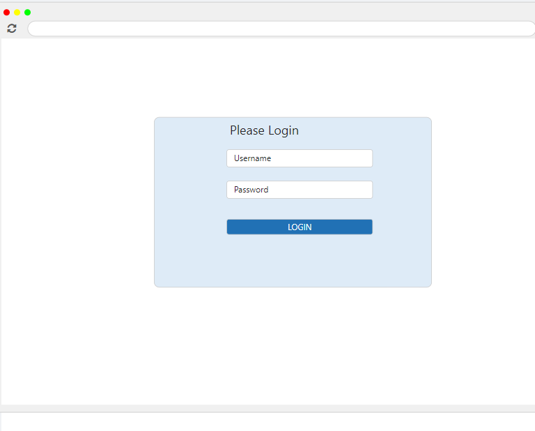
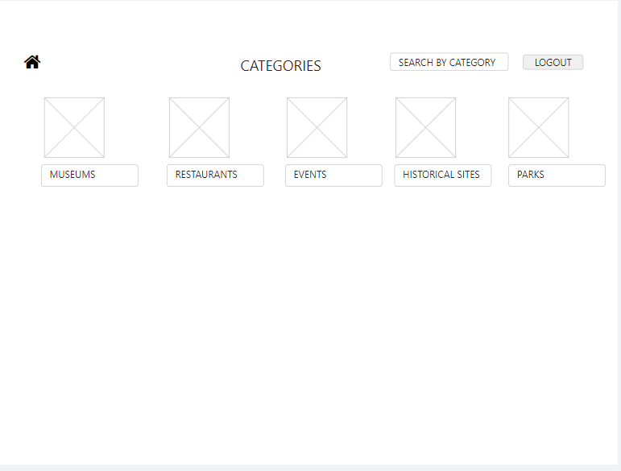
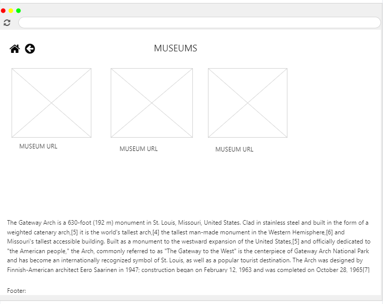

# Project Planning
For this assignment, you'll create some initial plans for your project.

## Assignment Description
[Project Planning Assignment](https://education.launchcode.org/liftoff/modules/assignments/project-planning)

## Submission Instructions

### Wireframes

Include at least 3 wireframes here, adding images or files to your repository as necessary. Format them as a bulleted/unordered list with links to the files.
* Landing page - https://mydraft.cc/c4be2l39h01mca5of9h0

* Registration page - https://mydraft.cc/c4a2n3b9h01mca5of830
  

* Log in page - https://mydraft.cc/c4a67ur9h01mca5of8c0

  
* Categories page - https://mydraft.cc/c4a5mq39h01mca5of890

  
* Attractions page - https://mydraft.cc/c4a68039h01mca5of8d0

### Project Tracker

Include a link to your public Trello board. Be sure you have user stories added for at least your first 2-week sprint.

https://trello.com/b/MtAVHfjJ/st-louis-attractions-board

### Project Repo Link

Include a link to your project on GitHub.
https://github.com/LaunchCodeLiftoffProjects/antwan-group-a